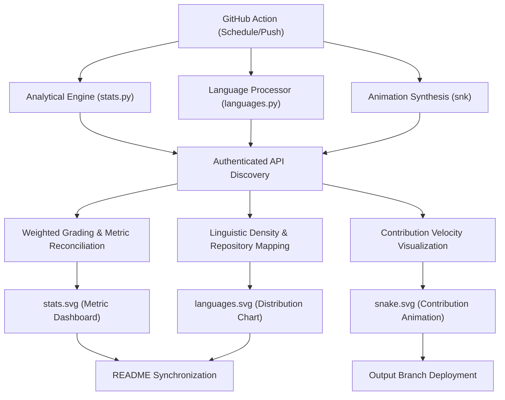

# Technical Specification: Amey-Thakur Profile Identity

## Architectural Overview

**Amey-Thakur Profile Identity** is a multi-modular analytical engine designed to synthesize real-time GitHub performance metrics into high-fidelity visual documentation. The system operates as a distributed automation hub, performing synchronized polling across repository data, linguistic distributions, and contribution history to generate a comprehensive visual identity.

### Distributed Synthesis Pipeline

---

## Technical Implementations

### 1. Analytical Engine (stats.py)
- **Metric Reconciliation**: Performs high-frequency polling to identify unique repository contexts and aggregate quantitative markers (Stars, Commits, PRs, etc.).
- **Scoring Algorithm**: Implements a calibrated grading system using weighted parameters:

| Metric | Weight |
| :---: | :---: |
| Stars | x10 |
| Commits | x1.5 |
| PRs | x50 |
| Issues | x5 |
| External Contributions | x100 |

- **Temporal Gating**: Restricts periodic updates to **12 AM and 12 PM local time**, utilizing dynamic timezone inference from Git metadata.

### 2. Language Processor (languages.py)
- **Linguistic Discovery**: Recursively analyzes the user's repository ecosystem to calculate byte-level language density.
- **Strategic Prioritization**: Implements exclusion logic to filter out tertiary boilerplate and non-impactful metadata, ensuring a professional representation of core technical expertise.
- **Visual Mapping**: Synthesizes density data into a calibrated SVG representation with dynamic progress bars and standardized color-coded markers.

### 3. Animation Synthesis (Snake)
- **Velocity Visualization**: Utilizes the `snk` engine to transcode the GitHub contribution grid into a dynamic vector animation.
- **Dual-Modality Rendering**: Generates both standard and high-contrast (Dark Mode) variations to support seamless profile integration across different user interface themes.
- **Asynchonous Deployment**: Visualizations are synchronized to a dedicated `output` branch via the `ghaction-github-pages` protocol, maintaining repository hygiene.

### 4. Resilience & Persistence Layer
- **State Persistence**: Utilizes `stats_cache.json` and `languages_cache.json` to store validated snapshots of performance data.
- **Fail-Safe Mechanism**: Automatically reverts to the persistence layer if primary API sources are inaccessible, ensuring continuous visual availability.

---

## Technical Prerequisites

- **Runtime Environment**: Python 3.9+ with standard library access.
- **Authentication**: `GITHUB_TOKEN` with repository and search scopes.
- **Workflow Engine**: Multi-stage GitHub Action orchestrators (`stats.yml`, `languages.yml`, `action.yml`).

---

*Technical Specification | Amey-Thakur Profile Identity | Version 1.1*
