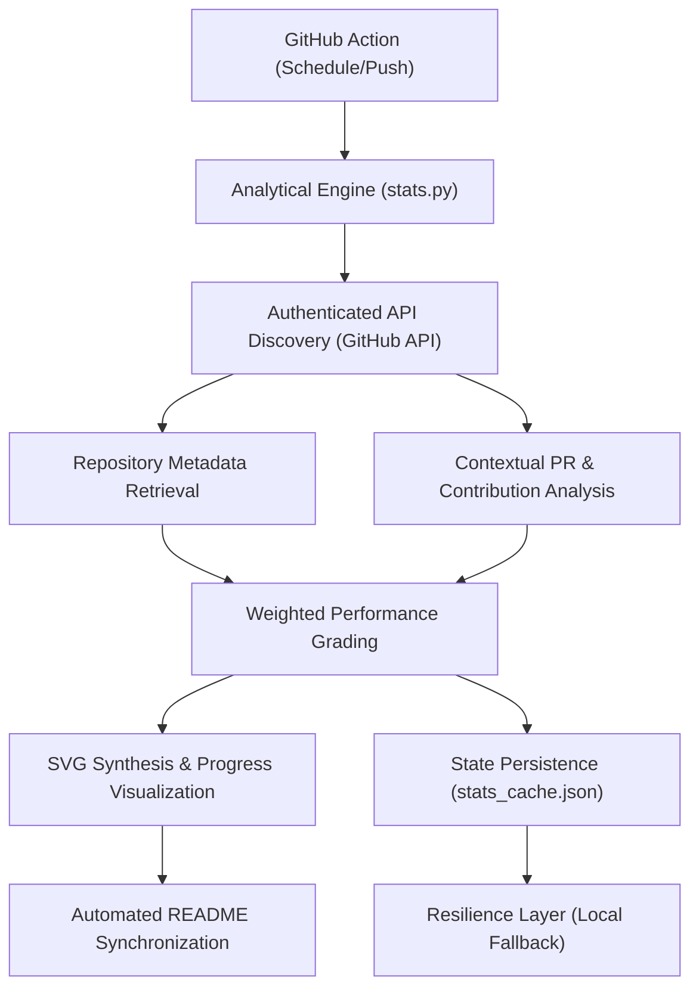

# Technical Specification: Amey-Thakur Profile Identity

## Architectural Overview

**Amey-Thakur Profile Identity** is a specialized analytical engine designed to synthesize real-time GitHub performance metrics into high-fidelity visual documentation. The system operates as an automated metadata hub, performing high-frequency polling of the GitHub API to generate a visually calibrated SVG dashboard that reflects professional impact, contribution volume, and project diversity.

### Data Synthesis Flow

---

## Technical Implementations

### 1. Analytical Engine Architecture
- **Core Logic**: Implemented in **Python 3**, utilized for comprehensive data orchestration, numeric normalization, and complex metric reconciliation.
- **Scoring Algorithm**: Employs a weighted grading system to assign performance tiers (A+, A, etc.). The scoring parameters are calibrated as follows:
    - **Stars**: weighted at x10
    - **Commits**: weighted at x1.5
    - **Pull Requests**: weighted at x50
    - **Issues**: weighted at x5
    - **External Contributions**: weighted at x100

### 2. Temporal Synchronization Gate
- **Execution Gating**: To maintain a bi-daily update cycle, the engine implements a temporal gate allowing scheduled execution only at **12 AM and 12 PM local time**.
- **Dynamic Timezone Detection**: Automatically infers the local environment's timezone offset by parsing the latest Git commit metadata, ensuring accurate localization without hardcoded offsets.
- **Bypass Protocol**: Manual triggers and push events are architected to bypass temporal gating, allowing for instantaneous on-demand updates.

### 3. Visual Synthesis & Visualization
- **SVG Rendering Engine**: Utilizes a custom XML synthesis module to generate professional dashboards with dynamic SVG progress rings, typography-based stats, and high-definition iconography.
- **Cache-Busting Integration**: Implements secondary query-string parameters (`?t=timestamp`) during README synchronization to bypass proxy caching and ensure real-time visual freshness.

### 4. Resilience & Persistence Layer
- **State Management**: Utilizes a local cache (`stats_cache.json`) to store validated snapshots of performance data.
- **Fail-Safe Mechanism**: In the event of API rate-limiting or network unavailability, the system automatically reverts to the persistence layer to serve legacy stats, preventing profile "blackouts."

---

## Technical Prerequisites

- **Runtime Environment**: Python 3.9+ with standard library access (urllib, json, re, subprocess).
- **Authentication**: A valid `GITHUB_TOKEN` with repository and search scope is required for authenticated API polling.
- **Workflow Engine**: GitHub Actions for automated triggers and scheduled synchronization.

---

*Technical Specification | Amey-Thakur Profile Identity | Version 1.0*
